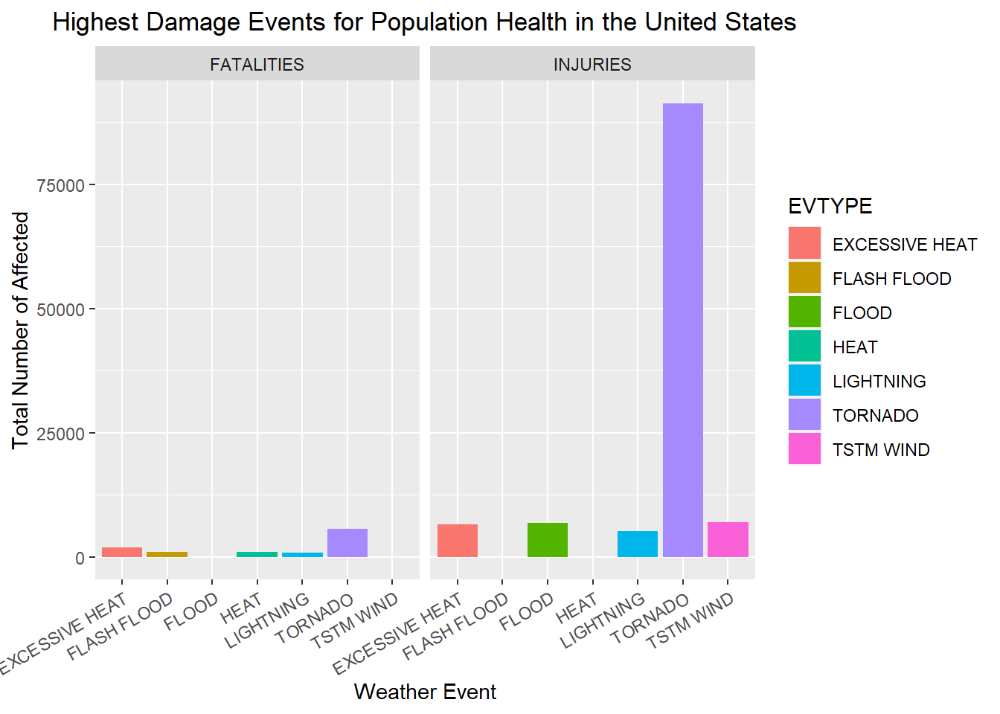
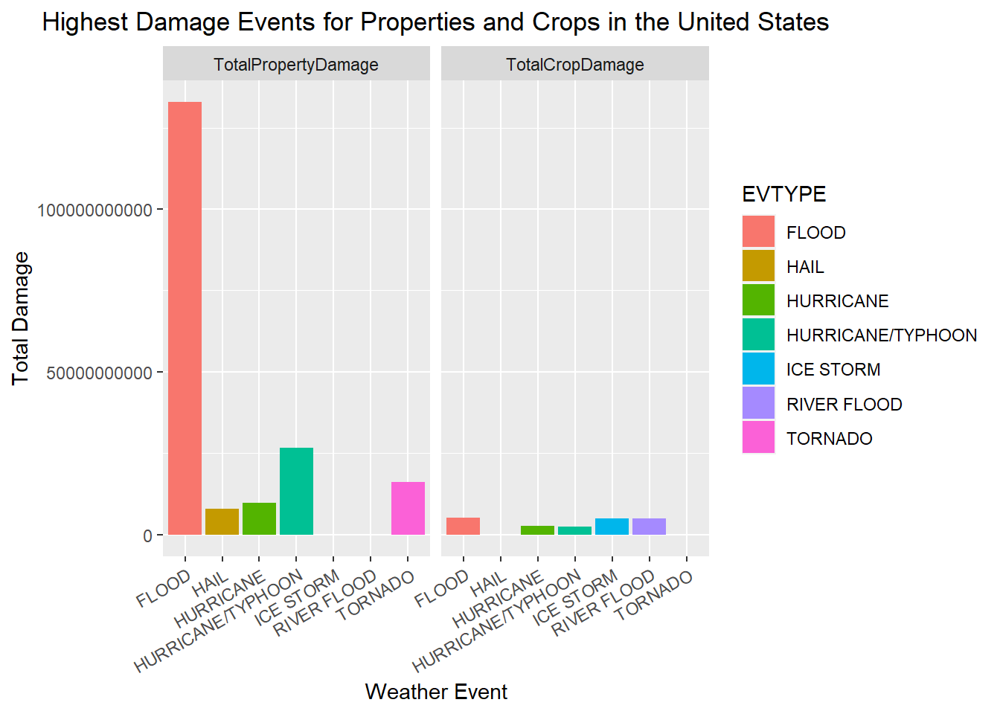

# An Analysis on the Impact of Severe Weather Events on the Population Health and the Economy of the United States

<br />

## Introduction 

<br />

Storms and other severe weather events can cause both public health and economic problems for communities and municipalities. Many severe events can result in fatalities, injuries, and property damage, and preventing such outcomes to the extent possible is a key concern.

This project involves exploring the U.S. National Oceanic and Atmospheric Administration's (NOAA) storm database. This database tracks characteristics of major storms and weather events in the United States, including when and where they occur, as well as estimates of any fatalities, injuries, and property damage.

<br />

## Synopsis

<br />

This submission is a part of the requirement on the Johns Hopkins University Data Science Specialization Course 5: *Reproducible Research* Course Project. On this Course Project, the goal is to explore and analyze the NOAA Storm Database and use the two questions as guidance for insights. The analysis addresses the two questions being asked namely:

* Across the United States, which types of events (as indicated in the ***EVTYPE*** variable) are most harmful with respect to **population health**?

* Across the United States, which types of events have the greatest **economic consequences**?


Results show that ***Tornado*** is the number one cause of fatalities and injuries in the United States. On the other hand, looking at the impact of weather events on the economy. It was seen that **Flood** have the largest damage on crops and much more emphasis on properties. 


<br />

## Data Processing

<br />

#### Data Retrieval and Loading

This part initializes the retrieval of the dataset to be used for the analysis, downloads the file and encode it as a readable csv file. Checks are also made to ensure no repetition of downloading the data and overwriting of the csv file. This also saves time on running.


```r
zipfile <-"storm_data.zip"
if (!file.exists(zipfile)) {
        download.file("https://d396qusza40orc.cloudfront.net/repdata%2Fdata%2FStormData.csv.bz2", destfile =  "storm_data.zip")
}
```


```r
if (!"storm_data" %in% ls()) {
        storm_data <- read.csv("storm_data.zip")
}
```

<br />

#### Data Checking and Data Formatting

This part further examines the data by checking the column names and initial values on each of the variable.


```r
    library(knitr)
    library(kableExtra)
    names(storm_data)
```

```
##  [1] "STATE__"    "BGN_DATE"   "BGN_TIME"   "TIME_ZONE"  "COUNTY"    
##  [6] "COUNTYNAME" "STATE"      "EVTYPE"     "BGN_RANGE"  "BGN_AZI"   
## [11] "BGN_LOCATI" "END_DATE"   "END_TIME"   "COUNTY_END" "COUNTYENDN"
## [16] "END_RANGE"  "END_AZI"    "END_LOCATI" "LENGTH"     "WIDTH"     
## [21] "F"          "MAG"        "FATALITIES" "INJURIES"   "PROPDMG"   
## [26] "PROPDMGEXP" "CROPDMG"    "CROPDMGEXP" "WFO"        "STATEOFFIC"
## [31] "ZONENAMES"  "LATITUDE"   "LONGITUDE"  "LATITUDE_E" "LONGITUDE_"
## [36] "REMARKS"    "REFNUM"
```

```r
    kable(storm_data[1:3, 1:12])  %>%
        kable_styling(font_size = 8)
```

<table class="table" style="font-size: 8px; margin-left: auto; margin-right: auto;">
 <thead>
  <tr>
   <th style="text-align:right;"> STATE__ </th>
   <th style="text-align:left;"> BGN_DATE </th>
   <th style="text-align:left;"> BGN_TIME </th>
   <th style="text-align:left;"> TIME_ZONE </th>
   <th style="text-align:right;"> COUNTY </th>
   <th style="text-align:left;"> COUNTYNAME </th>
   <th style="text-align:left;"> STATE </th>
   <th style="text-align:left;"> EVTYPE </th>
   <th style="text-align:right;"> BGN_RANGE </th>
   <th style="text-align:left;"> BGN_AZI </th>
   <th style="text-align:left;"> BGN_LOCATI </th>
   <th style="text-align:left;"> END_DATE </th>
  </tr>
 </thead>
<tbody>
  <tr>
   <td style="text-align:right;"> 1 </td>
   <td style="text-align:left;"> 4/18/1950 0:00:00 </td>
   <td style="text-align:left;"> 0130 </td>
   <td style="text-align:left;"> CST </td>
   <td style="text-align:right;"> 97 </td>
   <td style="text-align:left;"> MOBILE </td>
   <td style="text-align:left;"> AL </td>
   <td style="text-align:left;"> TORNADO </td>
   <td style="text-align:right;"> 0 </td>
   <td style="text-align:left;">  </td>
   <td style="text-align:left;">  </td>
   <td style="text-align:left;">  </td>
  </tr>
  <tr>
   <td style="text-align:right;"> 1 </td>
   <td style="text-align:left;"> 4/18/1950 0:00:00 </td>
   <td style="text-align:left;"> 0145 </td>
   <td style="text-align:left;"> CST </td>
   <td style="text-align:right;"> 3 </td>
   <td style="text-align:left;"> BALDWIN </td>
   <td style="text-align:left;"> AL </td>
   <td style="text-align:left;"> TORNADO </td>
   <td style="text-align:right;"> 0 </td>
   <td style="text-align:left;">  </td>
   <td style="text-align:left;">  </td>
   <td style="text-align:left;">  </td>
  </tr>
  <tr>
   <td style="text-align:right;"> 1 </td>
   <td style="text-align:left;"> 2/20/1951 0:00:00 </td>
   <td style="text-align:left;"> 1600 </td>
   <td style="text-align:left;"> CST </td>
   <td style="text-align:right;"> 57 </td>
   <td style="text-align:left;"> FAYETTE </td>
   <td style="text-align:left;"> AL </td>
   <td style="text-align:left;"> TORNADO </td>
   <td style="text-align:right;"> 0 </td>
   <td style="text-align:left;">  </td>
   <td style="text-align:left;">  </td>
   <td style="text-align:left;">  </td>
  </tr>
</tbody>
</table>

```r
    kable(storm_data[1:3, 13:26]) %>%
        kable_styling(font_size = 8)
```

<table class="table" style="font-size: 8px; margin-left: auto; margin-right: auto;">
 <thead>
  <tr>
   <th style="text-align:left;"> END_TIME </th>
   <th style="text-align:right;"> COUNTY_END </th>
   <th style="text-align:left;"> COUNTYENDN </th>
   <th style="text-align:right;"> END_RANGE </th>
   <th style="text-align:left;"> END_AZI </th>
   <th style="text-align:left;"> END_LOCATI </th>
   <th style="text-align:right;"> LENGTH </th>
   <th style="text-align:right;"> WIDTH </th>
   <th style="text-align:right;"> F </th>
   <th style="text-align:right;"> MAG </th>
   <th style="text-align:right;"> FATALITIES </th>
   <th style="text-align:right;"> INJURIES </th>
   <th style="text-align:right;"> PROPDMG </th>
   <th style="text-align:left;"> PROPDMGEXP </th>
  </tr>
 </thead>
<tbody>
  <tr>
   <td style="text-align:left;">  </td>
   <td style="text-align:right;"> 0 </td>
   <td style="text-align:left;"> NA </td>
   <td style="text-align:right;"> 0 </td>
   <td style="text-align:left;">  </td>
   <td style="text-align:left;">  </td>
   <td style="text-align:right;"> 14.0 </td>
   <td style="text-align:right;"> 100 </td>
   <td style="text-align:right;"> 3 </td>
   <td style="text-align:right;"> 0 </td>
   <td style="text-align:right;"> 0 </td>
   <td style="text-align:right;"> 15 </td>
   <td style="text-align:right;"> 25.0 </td>
   <td style="text-align:left;"> K </td>
  </tr>
  <tr>
   <td style="text-align:left;">  </td>
   <td style="text-align:right;"> 0 </td>
   <td style="text-align:left;"> NA </td>
   <td style="text-align:right;"> 0 </td>
   <td style="text-align:left;">  </td>
   <td style="text-align:left;">  </td>
   <td style="text-align:right;"> 2.0 </td>
   <td style="text-align:right;"> 150 </td>
   <td style="text-align:right;"> 2 </td>
   <td style="text-align:right;"> 0 </td>
   <td style="text-align:right;"> 0 </td>
   <td style="text-align:right;"> 0 </td>
   <td style="text-align:right;"> 2.5 </td>
   <td style="text-align:left;"> K </td>
  </tr>
  <tr>
   <td style="text-align:left;">  </td>
   <td style="text-align:right;"> 0 </td>
   <td style="text-align:left;"> NA </td>
   <td style="text-align:right;"> 0 </td>
   <td style="text-align:left;">  </td>
   <td style="text-align:left;">  </td>
   <td style="text-align:right;"> 0.1 </td>
   <td style="text-align:right;"> 123 </td>
   <td style="text-align:right;"> 2 </td>
   <td style="text-align:right;"> 0 </td>
   <td style="text-align:right;"> 0 </td>
   <td style="text-align:right;"> 2 </td>
   <td style="text-align:right;"> 25.0 </td>
   <td style="text-align:left;"> K </td>
  </tr>
</tbody>
</table>

```r
    kable(storm_data[1:3, 27:37]) %>%
        kable_styling(font_size = 8)
```

<table class="table" style="font-size: 8px; margin-left: auto; margin-right: auto;">
 <thead>
  <tr>
   <th style="text-align:right;"> CROPDMG </th>
   <th style="text-align:left;"> CROPDMGEXP </th>
   <th style="text-align:left;"> WFO </th>
   <th style="text-align:left;"> STATEOFFIC </th>
   <th style="text-align:left;"> ZONENAMES </th>
   <th style="text-align:right;"> LATITUDE </th>
   <th style="text-align:right;"> LONGITUDE </th>
   <th style="text-align:right;"> LATITUDE_E </th>
   <th style="text-align:right;"> LONGITUDE_ </th>
   <th style="text-align:left;"> REMARKS </th>
   <th style="text-align:right;"> REFNUM </th>
  </tr>
 </thead>
<tbody>
  <tr>
   <td style="text-align:right;"> 0 </td>
   <td style="text-align:left;">  </td>
   <td style="text-align:left;">  </td>
   <td style="text-align:left;">  </td>
   <td style="text-align:left;">  </td>
   <td style="text-align:right;"> 3040 </td>
   <td style="text-align:right;"> 8812 </td>
   <td style="text-align:right;"> 3051 </td>
   <td style="text-align:right;"> 8806 </td>
   <td style="text-align:left;">  </td>
   <td style="text-align:right;"> 1 </td>
  </tr>
  <tr>
   <td style="text-align:right;"> 0 </td>
   <td style="text-align:left;">  </td>
   <td style="text-align:left;">  </td>
   <td style="text-align:left;">  </td>
   <td style="text-align:left;">  </td>
   <td style="text-align:right;"> 3042 </td>
   <td style="text-align:right;"> 8755 </td>
   <td style="text-align:right;"> 0 </td>
   <td style="text-align:right;"> 0 </td>
   <td style="text-align:left;">  </td>
   <td style="text-align:right;"> 2 </td>
  </tr>
  <tr>
   <td style="text-align:right;"> 0 </td>
   <td style="text-align:left;">  </td>
   <td style="text-align:left;">  </td>
   <td style="text-align:left;">  </td>
   <td style="text-align:left;">  </td>
   <td style="text-align:right;"> 3340 </td>
   <td style="text-align:right;"> 8742 </td>
   <td style="text-align:right;"> 0 </td>
   <td style="text-align:right;"> 0 </td>
   <td style="text-align:left;">  </td>
   <td style="text-align:right;"> 3 </td>
  </tr>
</tbody>
</table>

<br />

#### Subsetting the Data

Subsetting `storm_data` to include only the relevant columns needed to address the questions. Thus, two data sets are formed: `health_data` and `economic_data`.


```r
library(dplyr)
health_data <- storm_data %>% 
    select(EVTYPE, FATALITIES, INJURIES)
economic_data <-  storm_data %>% 
    select(EVTYPE, PROPDMG, PROPDMGEXP, CROPDMG, CROPDMGEXP)
```

Next, further checking the dimensions and the characteristics of the variables that will be used for the analysis.

```r
kable(health_data[1:10,])
```

<table>
 <thead>
  <tr>
   <th style="text-align:left;"> EVTYPE </th>
   <th style="text-align:right;"> FATALITIES </th>
   <th style="text-align:right;"> INJURIES </th>
  </tr>
 </thead>
<tbody>
  <tr>
   <td style="text-align:left;"> TORNADO </td>
   <td style="text-align:right;"> 0 </td>
   <td style="text-align:right;"> 15 </td>
  </tr>
  <tr>
   <td style="text-align:left;"> TORNADO </td>
   <td style="text-align:right;"> 0 </td>
   <td style="text-align:right;"> 0 </td>
  </tr>
  <tr>
   <td style="text-align:left;"> TORNADO </td>
   <td style="text-align:right;"> 0 </td>
   <td style="text-align:right;"> 2 </td>
  </tr>
  <tr>
   <td style="text-align:left;"> TORNADO </td>
   <td style="text-align:right;"> 0 </td>
   <td style="text-align:right;"> 2 </td>
  </tr>
  <tr>
   <td style="text-align:left;"> TORNADO </td>
   <td style="text-align:right;"> 0 </td>
   <td style="text-align:right;"> 2 </td>
  </tr>
  <tr>
   <td style="text-align:left;"> TORNADO </td>
   <td style="text-align:right;"> 0 </td>
   <td style="text-align:right;"> 6 </td>
  </tr>
  <tr>
   <td style="text-align:left;"> TORNADO </td>
   <td style="text-align:right;"> 0 </td>
   <td style="text-align:right;"> 1 </td>
  </tr>
  <tr>
   <td style="text-align:left;"> TORNADO </td>
   <td style="text-align:right;"> 0 </td>
   <td style="text-align:right;"> 0 </td>
  </tr>
  <tr>
   <td style="text-align:left;"> TORNADO </td>
   <td style="text-align:right;"> 1 </td>
   <td style="text-align:right;"> 14 </td>
  </tr>
  <tr>
   <td style="text-align:left;"> TORNADO </td>
   <td style="text-align:right;"> 0 </td>
   <td style="text-align:right;"> 0 </td>
  </tr>
</tbody>
</table>

```r
kable(economic_data[1:10,])
```

<table>
 <thead>
  <tr>
   <th style="text-align:left;"> EVTYPE </th>
   <th style="text-align:right;"> PROPDMG </th>
   <th style="text-align:left;"> PROPDMGEXP </th>
   <th style="text-align:right;"> CROPDMG </th>
   <th style="text-align:left;"> CROPDMGEXP </th>
  </tr>
 </thead>
<tbody>
  <tr>
   <td style="text-align:left;"> TORNADO </td>
   <td style="text-align:right;"> 25.0 </td>
   <td style="text-align:left;"> K </td>
   <td style="text-align:right;"> 0 </td>
   <td style="text-align:left;">  </td>
  </tr>
  <tr>
   <td style="text-align:left;"> TORNADO </td>
   <td style="text-align:right;"> 2.5 </td>
   <td style="text-align:left;"> K </td>
   <td style="text-align:right;"> 0 </td>
   <td style="text-align:left;">  </td>
  </tr>
  <tr>
   <td style="text-align:left;"> TORNADO </td>
   <td style="text-align:right;"> 25.0 </td>
   <td style="text-align:left;"> K </td>
   <td style="text-align:right;"> 0 </td>
   <td style="text-align:left;">  </td>
  </tr>
  <tr>
   <td style="text-align:left;"> TORNADO </td>
   <td style="text-align:right;"> 2.5 </td>
   <td style="text-align:left;"> K </td>
   <td style="text-align:right;"> 0 </td>
   <td style="text-align:left;">  </td>
  </tr>
  <tr>
   <td style="text-align:left;"> TORNADO </td>
   <td style="text-align:right;"> 2.5 </td>
   <td style="text-align:left;"> K </td>
   <td style="text-align:right;"> 0 </td>
   <td style="text-align:left;">  </td>
  </tr>
  <tr>
   <td style="text-align:left;"> TORNADO </td>
   <td style="text-align:right;"> 2.5 </td>
   <td style="text-align:left;"> K </td>
   <td style="text-align:right;"> 0 </td>
   <td style="text-align:left;">  </td>
  </tr>
  <tr>
   <td style="text-align:left;"> TORNADO </td>
   <td style="text-align:right;"> 2.5 </td>
   <td style="text-align:left;"> K </td>
   <td style="text-align:right;"> 0 </td>
   <td style="text-align:left;">  </td>
  </tr>
  <tr>
   <td style="text-align:left;"> TORNADO </td>
   <td style="text-align:right;"> 2.5 </td>
   <td style="text-align:left;"> K </td>
   <td style="text-align:right;"> 0 </td>
   <td style="text-align:left;">  </td>
  </tr>
  <tr>
   <td style="text-align:left;"> TORNADO </td>
   <td style="text-align:right;"> 25.0 </td>
   <td style="text-align:left;"> K </td>
   <td style="text-align:right;"> 0 </td>
   <td style="text-align:left;">  </td>
  </tr>
  <tr>
   <td style="text-align:left;"> TORNADO </td>
   <td style="text-align:right;"> 25.0 </td>
   <td style="text-align:left;"> K </td>
   <td style="text-align:right;"> 0 </td>
   <td style="text-align:left;">  </td>
  </tr>
</tbody>
</table>

```r
unique(economic_data$PROPDMGEXP)
```

```
##  [1] "K" "M" ""  "B" "m" "+" "0" "5" "6" "?" "4" "2" "3" "h" "7" "H" "-" "1" "8"
```

```r
unique(economic_data$CROPDMGEXP)
```

```
## [1] ""  "M" "K" "m" "B" "?" "0" "k" "2"
```

The structure of the `health_data` can be further modified for it to be suitable for the analysis.


```r
library(reshape2)
library(dplyr)
health_data_reshaped <- melt(health_data, id.vars = "EVTYPE", measure.vars = c("FATALITIES", "INJURIES"))
health_data_reshaped <- health_data_reshaped %>% rename(HARM = variable, VALUE = value)
kable(health_data_reshaped[1:10,])
```

<table>
 <thead>
  <tr>
   <th style="text-align:left;"> EVTYPE </th>
   <th style="text-align:left;"> HARM </th>
   <th style="text-align:right;"> VALUE </th>
  </tr>
 </thead>
<tbody>
  <tr>
   <td style="text-align:left;"> TORNADO </td>
   <td style="text-align:left;"> FATALITIES </td>
   <td style="text-align:right;"> 0 </td>
  </tr>
  <tr>
   <td style="text-align:left;"> TORNADO </td>
   <td style="text-align:left;"> FATALITIES </td>
   <td style="text-align:right;"> 0 </td>
  </tr>
  <tr>
   <td style="text-align:left;"> TORNADO </td>
   <td style="text-align:left;"> FATALITIES </td>
   <td style="text-align:right;"> 0 </td>
  </tr>
  <tr>
   <td style="text-align:left;"> TORNADO </td>
   <td style="text-align:left;"> FATALITIES </td>
   <td style="text-align:right;"> 0 </td>
  </tr>
  <tr>
   <td style="text-align:left;"> TORNADO </td>
   <td style="text-align:left;"> FATALITIES </td>
   <td style="text-align:right;"> 0 </td>
  </tr>
  <tr>
   <td style="text-align:left;"> TORNADO </td>
   <td style="text-align:left;"> FATALITIES </td>
   <td style="text-align:right;"> 0 </td>
  </tr>
  <tr>
   <td style="text-align:left;"> TORNADO </td>
   <td style="text-align:left;"> FATALITIES </td>
   <td style="text-align:right;"> 0 </td>
  </tr>
  <tr>
   <td style="text-align:left;"> TORNADO </td>
   <td style="text-align:left;"> FATALITIES </td>
   <td style="text-align:right;"> 0 </td>
  </tr>
  <tr>
   <td style="text-align:left;"> TORNADO </td>
   <td style="text-align:left;"> FATALITIES </td>
   <td style="text-align:right;"> 1 </td>
  </tr>
  <tr>
   <td style="text-align:left;"> TORNADO </td>
   <td style="text-align:left;"> FATALITIES </td>
   <td style="text-align:right;"> 0 </td>
  </tr>
</tbody>
</table>

<br />

#### Recoding the Variables

Variables `PROPDMGEX` and `PROPDMGEXP` on the `economic_data` will be recoded. The recoding done is based on the analysis that can be found on this: [How To Handle Exponent Value of PROPDMGEXP and CROPDMGEXP](https://rstudio-pubs-static.s3.amazonaws.com/58957_37b6723ee52b455990e149edde45e5b6.html)


```r
economic_data$PROPDMGEXP <- ifelse(economic_data$PROPDMGEXP %in% c("H", "h"), 100,
                                   ifelse(economic_data$PROPDMGEXP %in% c("K", "k"), 1000,
                                          ifelse(economic_data$PROPDMGEXP %in% c("M", "m"), 1000000,
                                                 ifelse(economic_data$PROPDMGEXP %in% c("B", "b"), 1000000000, 0))))
economic_data$CROPDMGEXP <- ifelse(economic_data$CROPDMGEXP %in% c("H", "h"), 100,
                                   ifelse(economic_data$CROPDMGEXP %in% c("K", "k"), 1000,
                                          ifelse(economic_data$CROPDMGEXP %in% c("M", "m"), 1000000,
                                                 ifelse(economic_data$CROPDMGEXP %in% c("B", "b"), 1000000000, 0))))
economic_data <- economic_data %>%  filter(PROPDMGEXP != 0 & CROPDMGEXP != 0)
```


The total damage is obtained by multiplying  `PROPDMG` with `PROPDMGEXP` and `CROPDMG` with `CROPDMGEXP` for the `economic_data`. Thus, defining a new variable `TotalPropertyDamage` and `TotalCropDamage`, respectively.


```r
options(scipen = 999)
economic_data$TotalPropertyDamage <- economic_data$PROPDMG*economic_data$PROPDMGEXP
economic_data$TotalCropDamage <- economic_data$CROPDMG*economic_data$CROPDMGEXP
economic_data$PROPDMG <- NULL
economic_data$PROPDMGEXP <- NULL
economic_data$CROPDMG <- NULL
economic_data$PROPDMGEXP <- NULL
economic_data_reshaped <- melt(economic_data, id.vars = "EVTYPE", measure.vars = c("TotalPropertyDamage", "TotalCropDamage"))
economic_data_reshaped <- economic_data_reshaped %>% rename(DAMAGE = variable, VALUE = value)
kable(economic_data_reshaped[1:10,])
```

<table>
 <thead>
  <tr>
   <th style="text-align:left;"> EVTYPE </th>
   <th style="text-align:left;"> DAMAGE </th>
   <th style="text-align:right;"> VALUE </th>
  </tr>
 </thead>
<tbody>
  <tr>
   <td style="text-align:left;"> HURRICANE OPAL/HIGH WINDS </td>
   <td style="text-align:left;"> TotalPropertyDamage </td>
   <td style="text-align:right;"> 100000000 </td>
  </tr>
  <tr>
   <td style="text-align:left;"> THUNDERSTORM WINDS </td>
   <td style="text-align:left;"> TotalPropertyDamage </td>
   <td style="text-align:right;"> 5000000 </td>
  </tr>
  <tr>
   <td style="text-align:left;"> HURRICANE ERIN </td>
   <td style="text-align:left;"> TotalPropertyDamage </td>
   <td style="text-align:right;"> 25000000 </td>
  </tr>
  <tr>
   <td style="text-align:left;"> HURRICANE OPAL </td>
   <td style="text-align:left;"> TotalPropertyDamage </td>
   <td style="text-align:right;"> 48000000 </td>
  </tr>
  <tr>
   <td style="text-align:left;"> HURRICANE OPAL </td>
   <td style="text-align:left;"> TotalPropertyDamage </td>
   <td style="text-align:right;"> 20000000 </td>
  </tr>
  <tr>
   <td style="text-align:left;"> THUNDERSTORM WINDS </td>
   <td style="text-align:left;"> TotalPropertyDamage </td>
   <td style="text-align:right;"> 50000 </td>
  </tr>
  <tr>
   <td style="text-align:left;"> THUNDERSTORM WINDS </td>
   <td style="text-align:left;"> TotalPropertyDamage </td>
   <td style="text-align:right;"> 500000 </td>
  </tr>
  <tr>
   <td style="text-align:left;"> TORNADO </td>
   <td style="text-align:left;"> TotalPropertyDamage </td>
   <td style="text-align:right;"> 500000 </td>
  </tr>
  <tr>
   <td style="text-align:left;"> TORNADO </td>
   <td style="text-align:left;"> TotalPropertyDamage </td>
   <td style="text-align:right;"> 500000 </td>
  </tr>
  <tr>
   <td style="text-align:left;"> THUNDERSTORM WINDS/HAIL </td>
   <td style="text-align:left;"> TotalPropertyDamage </td>
   <td style="text-align:right;"> 5000 </td>
  </tr>
</tbody>
</table>

<br />

## Results

<br />

### Question 1: Across the United States, which types of events (as indicated in the *EVTYPE* variable) are most harmful with respect to population health?

##### Based from the figure, it can be seen that tornadoes have the highest number of fatalities and injuries with a huge margin.

<br />


```r
library(ggplot2)
health_totals <- health_data_reshaped %>% 
    group_by(EVTYPE, HARM) %>% 
    summarise(total = sum(VALUE))
fatalities_total <- health_totals %>%  filter(HARM=="FATALITIES")
fatalities_total_sorted <- fatalities_total[order(fatalities_total$total, decreasing = TRUE), ][1:5,]
injuries_total <- health_totals %>%  filter(HARM=="INJURIES")
injuries_total_sorted <- injuries_total[order(injuries_total$total, decreasing = TRUE), ][1:5,]
question1 <-rbind(fatalities_total_sorted, injuries_total_sorted)
ggplot(question1, aes(fill=EVTYPE, y=total, x=EVTYPE)) + 
        geom_bar(position="stack", stat="identity") +
        facet_wrap(~HARM) +
        ggtitle("Highest Damage Events for Population Health in the United States") +
        xlab("Weather Event") +
        ylab("Total Number of Affected") +
        theme(axis.text.x = element_text(angle = 30, hjust = 1)) +
        theme(plot.title = element_text(hjust = 0.5))
```



<br />

### Question 2: Across the United States, which types of events have the greatest economic consequences?

##### Lastly, it can be seen that floods have the highest consequence in the economy be it in terms of damage to property or damage to crops.

<br />


```r
library(ggplot2)
economic_totals <- economic_data_reshaped %>% 
    group_by(EVTYPE, DAMAGE) %>% 
    summarise(total = sum(VALUE))
prop_damage_total <- economic_totals %>%  filter(DAMAGE=="TotalPropertyDamage")
prop_damage_total_sorted <- prop_damage_total[order(prop_damage_total$total, decreasing = TRUE), ][1:5,]
crop_damage_total <- economic_totals %>%  filter(DAMAGE=="TotalCropDamage")
crop_damage_total_sorted <- crop_damage_total[order(crop_damage_total$total, decreasing = TRUE), ][1:5,]
question2 <-rbind(prop_damage_total_sorted, crop_damage_total_sorted)
ggplot(question2, aes(fill=EVTYPE, y=total, x=EVTYPE)) + 
        geom_bar(position="stack", stat="identity") +
        facet_wrap(~DAMAGE) +
        ggtitle("Highest Damage Events for Properties and Crops in the United States") +
        xlab("Weather Event") +
        ylab("Total Damage") +
        theme(axis.text.x = element_text(angle = 30, hjust = 1)) +
        theme(plot.title = element_text(hjust = 0.5))
```


